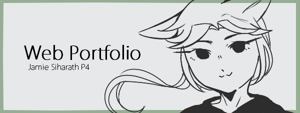

# sophmore

<!DOCTYPE html>
<html>
	<head>
		<meta charset="utf-8">
		<title>Web Portfolio: Jamie Siharath</title>
		<link type="text/css" rel="stylesheet" href="_assets/css/mystyle.css" media="screen">
		<link rel="shortcut icon" href="_assets/images/favicon.png">
	</head>
	<body>
		
			<a href="#main">Skip to main content ♥</a>
		

		
		 

		

		</li>
		

		

		<h1>Web Portfolio</h1>
			
		

			<ul>
				<li>Jamie Siharath
					</li>
				<li><a href="mailto:jamie.379099@nv.ccsd.net">my email</a>
					
				<a href="siharath_portfolio/graphic.html">  
					</li>
					</a>
					</li>
				</ul>
			</ul>
		

		

			<ul>
				<li>Web Design and Development I
					</li>
				<li>Teacher: Ms.Chang
					</li>
				<li><a href="http://www.swcta.net/">Southwest 		Career and Technical Academy</a>
					</li>
				<li>Class of 2016-2017
					</li>
			</ul>
		
 

		<nav>	
			<ul>
				<li><a href="index.html">Home</a>
					</li>
				<li><a href="accessibility.html">Accessibility</a>	  </li>
				<li><a href="usability.html">Usability</a>
					</li>
				<li><a href="graphics.html">Graphics</a>
					</li>
				<li><a href="javascript.html">Javascript</a>
					</li>
				<li><a href="javascript.html">Tools</a>
					</li>
				<li><a href="video.html">Video</a>
					</li>
			</ul>
		</nav>
	
		<main id="main">
			
his website include examples of my work in Ms.Chang's Web Design and Development I class.

			<h2>Unit 2</h2>
				
The things I learned how to do was learning the basics of coding. The things I learned was coding a video, coding an index, and setting the basics for my other pages.

		
			<ul>
				<li>Sublime Text 2</a>
					</li>
				<li>Washington.edu
					</li>
				<li>w3schools</a>
					</li>
			</ul>

			
			<h2>Unit 3</h2>
				
During Unit 3 I've learned the basics of CSS. The skills we've learn is how to change simple property of website, such as the background color and fonts. Later we learn how to add dropcaps, box models, and id/classes to further stylize and customize our own websites. By the end of the semester we learned how to customize our navigation menus. 
	

			<ul>
				<li>Sublime Text 2</a>
					</li>
				<li>Washington.edu
					</li>
				<li>w3schools</a>
					</li>
			</ul>
	
		
			<h2>Unit 4</h2>
			<a href="graphics.html">
				</li></a>
			
			
During Unit 4 we learned how to implement graphics and graphically work into web design. At the beginning of the unit we learned about graphics and how they apply to web design. The things we learned include, what different image types are and how they are used. We also learned how to make essential things for a website, such as favicons, background images, and web banners. We also updated our graphics page with what we’ve learned.

			<ul>
				<li>Sublime Text 2</a>
					</li>
				<li>Washington.edu
					</li>
				<li>w3schools</a>
					</li>
			</ul>
	
		
			<h2>Unit 5</h2>
		
			
	In Unit 5, we learned the basics and uses of JavaScript. We first learned how to create basic alerts and debug/error alerts. Then we created created a functioning clock with if, then, else loops, and functions. The features of the functioning clock included a real time counter and a AM/ PM cycle. After this, we created buttons to control our videos. We also applied our previous CCS knowledge to style our functioning clock and buttons.

			
			<ul>
				<li>Sublime Text 2</a>
					</li>
				<li>Washington.edu
					</li>
				<li>w3schools</a>
					</li>
					
			</ul>
			

			<h2>Unit 6</h2>
				
 During Unit 6 we learned about how to check your website. Through website evaluations. We used different websites online to critque and review over our websites. Using the evaluations these websites gave use we fixed our websites. We finished the Unit by having three people review over our website and test things. We used their feedback to fix our websites as well.

				<li>Sublime Text 2</a>
					</li>
				<li><a href="https://validator.w3.org/nu/#file">HTML Validator</a>
					</li>
				<li><a href="https://jigsaw.w3.org/css-validator/">CSS Validator</a>
					</li>
				<li><a href="http://wave.webaim.org/">Web Aim</a> </a>
					</li>

			<h2>Unit 7</h2>
				
 During Unit 6 we learned about web service providers. By using these services we are able to host our own websites. We learned how to evaluated the quality of different services through their affordability, reliability, customer services, and features. We used this information to compare and contrast different services as well.

					<li><a href="https://webhostinggeeks.com/user-reviews/applegate-technologies/">AppleGate Technology</a> </a>
					</li>
		</main>
	</body>
</html>
